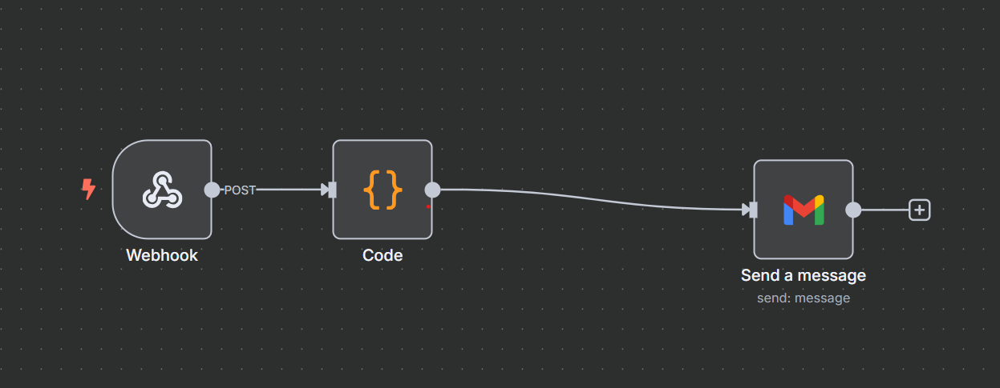

# 🧑‍💼 Employee Dashboard

A modern HR management dashboard built with **React + Supabase**  
🔐 Manage employees, send email notifications, and maintain a clean UI.

🔗 **Live Demo**: https://employeemanagementation.netlify.app/

---

### 📸 Screenshot

---

### 🧠 Features

- Add/Edit/Delete Employees
- Auto-generate Employee ID (`EMP001`, `EMP002`, ...)
- Supabase as backend database
- Send welcome email via **n8n webhook**
- Responsive & modern Tailwind UI

---

### 🛠️ Tech Stack

- React + Vite
- Supabase
- Tailwind CSS
- n8n (Webhook Email Trigger)
- Netlify (Hosting)

📂 Folder Structure
src/
├── components/
│   ├── Header.js
│   ├── EmployeeTable.js
│   └── SuccessPopup.js
├── pages/
│   └── Dashboard.js
├── services/
│   ├── supabaseClient.js
│   └── employeeService.js
├── App.js
└── index.js

---

### 📊 Workflow

